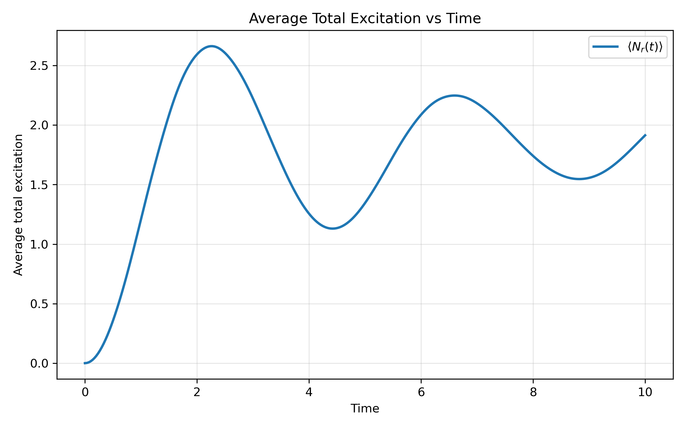
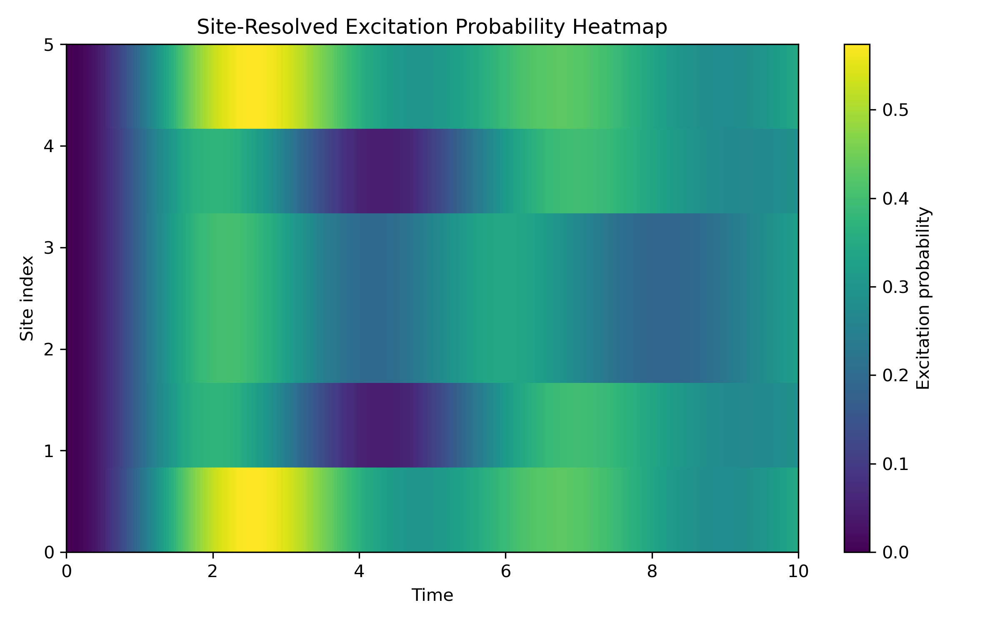

# Numerical Study of Excitation Dynamics and Correlations in a Rydberg Atom Chain

## Example Output

Example average excitation dynamics:



Example site-resolved excitation heatmap:



## 1. Project Overview

This project is a first numerical framework for studying excitation dynamics and correlations in a finite one-dimensional chain of laser-driven Rydberg atoms.

It is designed as a starting template for a summer research project. The main goals are:

- readable code
- modular structure
- beginner-friendly explanations
- easy future modification

Each atom is treated as a two-level system:

- `|g>` = ground state
- `|r>` = Rydberg excited state

The basis convention used throughout the code is:

- `0 = |g>`
- `1 = |r>`

For a chain of `N` atoms, the many-body Hilbert space has dimension:

```text
dim(H) = 2^N
```

This is because each atom has two possible states, and the full many-body basis contains all binary strings of length `N`.

This first version is intended for small systems such as `N = 4, 5, 6`. It may also work for slightly larger systems, but exact simulation becomes expensive quickly as `N` increases.

---

## 2. Physical Model

The system is modelled as an interacting spin-1/2 chain with coherent laser driving.

The total Hamiltonian is:

```text
H = H_drive + H_detuning + H_int
```

More explicitly:

```text
H = (Omega / 2) * sum_i sigma_x^(i)
    - Delta * sum_i n_i
    + sum_{i < j} V_ij n_i n_j
```

The physical meaning of the parameters is:

- `Omega`: Rabi frequency, which sets the coherent drive strength
- `Delta`: laser detuning
- `V`: overall interaction strength scale
- `n_i`: local Rydberg excitation number operator at site `i`

The local number operator is:

```text
n_i = |r_i><r_i|
```

So `n_i` measures whether atom `i` is in the Rydberg state.

---

## 3. Hamiltonian Terms

### 3.1 Coherent Driving

```text
H_drive = (Omega / 2) * sum_i sigma_x^(i)
```

This term flips atoms between `|g>` and `|r>`.

Physically, it represents coherent laser driving between the ground state and the Rydberg excited state.

---

### 3.2 Detuning

```text
H_detuning = - Delta * sum_i n_i
```

This term changes the energy cost of creating Rydberg excitations.

The detuning `Delta` controls how favourable or unfavourable it is for atoms to become excited.

---

### 3.3 Interaction

```text
H_int = sum_{i < j} V_ij n_i n_j
```

This term contributes when both sites `i` and `j` are excited.

Physically, it captures the fact that nearby Rydberg excitations can strongly interact. In the strong-interaction regime, this can suppress simultaneous nearby excitations, which is related to the Rydberg blockade effect.

---

## 4. Interaction Options

Two interaction models are included.

### 4.1 Power-law interaction

```text
V_ij = V / |i - j|^6
```

Use:

```python
interaction_type = "power_law"
```

This is a simple van der Waals-type interaction model.

---

### 4.2 Nearest-neighbour-only interaction

```text
V_ij = V    if j = i + 1
V_ij = 0    otherwise
```

Use:

```python
interaction_type = "nearest_neighbor"
```

This is a simpler truncated model. It is useful for comparison with basic lattice spin models.

---

## 5. Initial State and Time Evolution

The default initial state is:

```text
|ggg...g>
```

This means all atoms start in the ground state.

The initial state can also be changed in `main.py` using the variable `initial_bitstring`.

The convention is:

```text
0 = |g>
1 = |r>
```

The leftmost character corresponds to site 0, and the rightmost character corresponds to site N - 1.

Examples:

```python
initial_bitstring = "000000"  # |gggggg>, all atoms start in the ground state
initial_bitstring = "100000"  # |rggggg>, the first atom starts in the Rydberg state
initial_bitstring = "010000"  # |grgggg>, the second atom starts in the Rydberg state
initial_bitstring = "101010"  # |rgrgrg>, alternating excitation pattern
```

This is useful for studying different state-preparation patterns, local excitation dynamics, and blockade-related behaviour.

This is a natural starting point because it is simple and allows us to observe how the laser drive creates Rydberg excitations over time.

The current code uses exact diagonalisation for a time-independent Hamiltonian.

The time evolution is:

```text
|psi(t)> = U exp(-i E t) U^dagger |psi(0)>
```

where:

- `E` contains the energy eigenvalues
- `U` contains the eigenvectors of the Hamiltonian
- `|psi(0)>` is the initial state
- `|psi(t)>` is the state at time `t`

The code works in units where:

```text
hbar = 1
```

Therefore, time is measured in inverse energy or inverse frequency units.

---

## 6. Observables

The code calculates several physically useful observables.

### 6.1 Average total excitation number

```text
<N_r(t)> = <psi(t)| sum_i n_i |psi(t)>
```

This measures the average total number of atoms in the Rydberg state at time `t`.

---

### 6.2 Excitation density

```text
excitation density = <N_r(t)> / N
```

This gives the average fraction of atoms that are excited.

---

### 6.3 Site-resolved excitation probability

```text
<n_i(t)>
```

This measures the probability that atom `i` is in the Rydberg state at time `t`.

This is useful for seeing whether excitations are uniformly distributed or spatially structured.

---

### 6.4 Two-point correlation function

```text
<n_i n_j>
```

This measures the joint probability that both atoms `i` and `j` are excited.

It is useful for studying whether excitations tend to appear together or avoid each other.

---

### 6.5 Connected correlation function

```text
C_ij = <n_i n_j> - <n_i><n_j>
```

The connected correlation removes the part that would already be present if the two sites behaved independently.

It is therefore useful for identifying genuine correlations caused by interactions.

---

## 7. What the Example Script Produces

Running `main.py` generates plots such as:

- average excitation versus time
- excitation density versus time
- site-resolved excitation heatmap
- final-time site excitation distribution
- final-time two-point correlation matrix
- final-time connected correlation matrix
- comparison of excitation dynamics for several interaction strengths

These plots help show:

- coherent oscillations
- the effect of detuning
- how strong interactions suppress multiple excitations
- blockade-related spatial correlation patterns

---

## 8. How to Run

Install the required packages:

```bash
pip install -r requirements.txt
```

Then run:

```bash
python main.py
```

If `python main.py` does not work because Windows points to the wrong Python interpreter, use your Anaconda Python path instead, for example:

```powershell
& "C:\Users\AndyW\anaconda3\python.exe" main.py
```

The script will save figures into a folder called:

```text
figures/
```

---

## 9. Project Structure

```text
rydberg_chain_project/
    README.md
    main.py
    rydberg_model.py
    observables.py
    plotting.py
    parameter_scan.py
    requirements.txt
    figures/
```

The main files are:

- `main.py`: main script for running an example simulation
- `rydberg_model.py`: construction of operators, Hamiltonian, and initial state
- `observables.py`: calculation of excitation numbers and correlations
- `plotting.py`: plotting functions
- `parameter_scan.py`: helper functions for scanning parameters
- `requirements.txt`: required Python packages
- `figures/`: output folder for generated plots

---

## 10. Numerical Limitations

This first version is based on exact Hamiltonian construction and exact diagonalisation.

This is useful because it is transparent and easy to explain, but it also means the method becomes expensive for larger systems.

The main reason is the Hilbert space growth:

```text
dim(H) = 2^N
```

So every extra atom doubles the Hilbert space dimension.

Current limitations of this first version:

- closed-system dynamics only
- time-independent Hamiltonian only
- open boundary conditions only
- no decoherence or dissipation
- no shaped pulses
- no direct comparison with experimental data yet
- dense matrices rather than sparse methods

---

## 11. Possible Future Extensions

This project was written to make later changes easier.

Natural next steps include:

- time-dependent `Omega(t)` or `Delta(t)`
- pulse shaping
- spontaneous decay or dephasing
- Lindblad open-system evolution
- site-dependent parameters
- disorder
- periodic boundary conditions
- sparse-matrix methods
- comparison with lab data
- adapting the Hamiltonian to match the supervisor's experimental system

---

## 12. Which File to Modify

If the supervisor changes the Hamiltonian, the first file to edit is:

```text
rydberg_model.py
```

If new observables need to be added or existing observables need to be modified, edit:

```text
observables.py
```

If the plotting style or output figures need to be changed, edit:

```text
plotting.py
```

If new parameter comparisons are needed, edit:

```text
parameter_scan.py
```

---

## 13. Current Status

This repository currently provides a clean initial simulation framework for a finite Rydberg atom chain.

It is not intended to be a final research-grade simulation yet. Instead, it is a flexible starting point that can later be adjusted to include more realistic experimental parameters, decoherence models, pulse shapes, or lab-specific observables.
